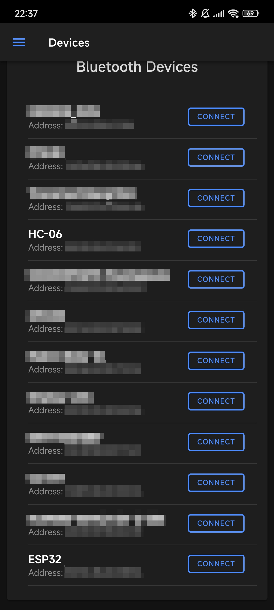
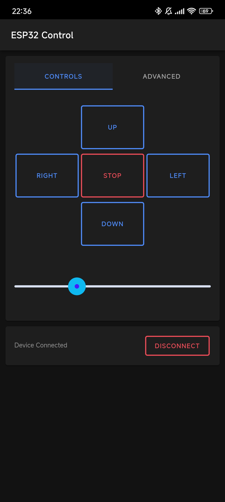
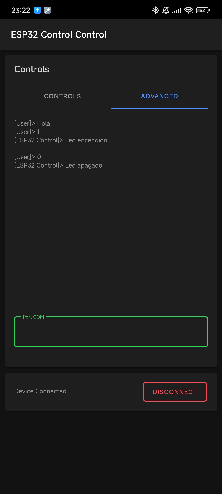

# Bluetooth Serial Controller

Ionic-Angluar App to control a Bluetooth serial device like the ESP32 or the HC-06 module.

> [!NOTE]
> This application is developed to control a control remote car which uses an PIC16F877A with the HC-06.

## Basic Controls

* `w` - Accelerate
* `s` - Reverse
* `x` - Stop
* `a` - Left
* `d` - Right

Also, it implements a slider to control a servomotor, so its angle can be adjusted with it. The default values goes from `0x10` to `0x60` (defined like this due to the microcontroller requirements).

## Advanced mode

This application includes a simple _terminal_ to communicate with the Bluetooth device.

## Screenshots

| Main View                                           | Basic Control                                           | Advanced Mode                                              |
| --------------------------------------------------- | ------------------------------------------------------- | ---------------------------------------------------------- |
|  |  |  |
